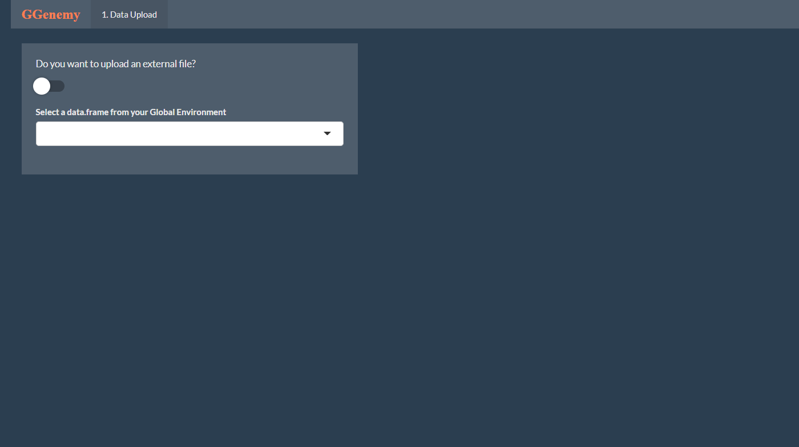
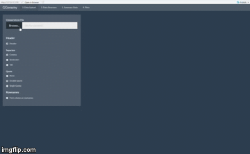
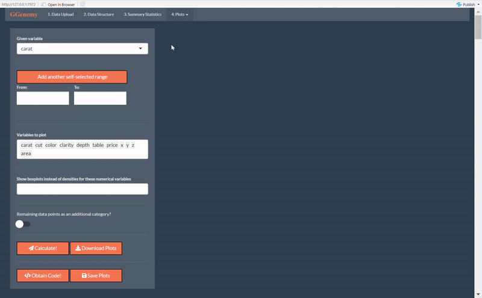

<!-- README.md is generated from README.Rmd. Please edit that file -->

```{r, include = FALSE}
knitr::opts_chunk$set(
  collapse = TRUE,
  comment = "#>",
  fig.path = "man/figures/README-",
  out.width = "100%"
)
```
# GGenemy

<!-- badges: start -->
  [](https://travis-ci.org/tajohu/GGenemy)
<!-- badges: end -->

`GGenemy` is a package that helps you in your analysis of multidimensional data by providing calculation and visualization tools for multiple conditioning. 
The user's workflow is mainly supported by an interactive Shiny app, but all of
the package's main functions can be utilized in RStudio, too. 

## Installation

`GGenemy` is available on GitHub. You can install the package and all its
dependencies via the `install_github()` command from the `devtools` package. Set `build_vignettes = TRUE` to have access to the vignette. 

``` r
# install.packages("devtools")
devtools::install_github("tajohu/GGenemy", build_vignettes = TRUE)
```

## Workflow

We will now walk you through the main steps you will take when working 
with `GGenemy`.
After loading and attaching the package, the shiny app is started by executing a 
function of the same name.

```r 
library(GGenemy)
GGenemy()
```
The command opens a tab in your browser that looks like this:



### Step 1: Data Upload

After successfully starting the app, you can choose one of two options to access your data.

**Option 1:** Open the drop-down menu and select a `data.frame` that is already loaded into your Global Environment. Make sure that the data is read in cleanly and, if necessary, go back to RStudio to fix any mistakes you may have made during the reading process before. 

[hier GIF von Auswahl des Datensatzes aus drop-down Liste]

**Option 2:** Toggle the switch on the upper left and hit "Browse..." to select an external .txt or .csv file from your computer. After the file has been read for the first time, you can adjust several options on how to import it, e.g. indicate whether the file has a `header` or not.

[Hier GIF von umstellen des Switches auf einlesen von externem file + upload davon. Das GIF hier drunter kann dann weg, habs nur drin gelassen um zu gucken wie das generell aussieht]



No matter which alternative you opt for, you get a first look at the data you intend to work with. 

### Step 2: Data Structure

The second step in your workflow will be getting a better feeling for the variables in your dataset. In the "Data Structure" tab, you get to see a range of unconditional summary statistics for numerical variables, as well as counts and percentages for categories of factors. Moreover, you have the chance to correct misclassifications of variables which look like numerics, but are actually factors. 

[hier GIF von Data Structure einfügen, am besten mit Beispiel für Numeric -> Factor]

### Step 3: Conditional Summary Statistics

Step 3 introduces one of the two core functionalities of `GGenemy`: the calculation of conditional summary statistics. In this section, you are able to compute the conditional mean, variance, skewness and kurtosis for all your numeric variables,
given another numeric variable. Further individual control of the process is given by a slider bar that determines the amount of quantiles you want to partition the given variable into. 

The conditional summary statistics are displayed as both values in a table and line plots for each variable. 

[hier GIF oder Foto von Summary Statistics einfügen, am besten mit Auswahl der Checkboxes und Berechnung der Werte]

### Step 4: Conditional Plots

The heart of `GGenemy` lies in its fourth step, the visualization of conditional densities, boxplots and bar plots. You get to choose whether you want to condition on quantiles with equal amounts of data or self-selected ranges of values.

#### Equally split quantiles

Working in the first subtab of "Plots" means that the data of a numeric given variable will be partitioned equally into the amount of chosen quantiles. When conditioning on a factor, the quantiles will be set to all of the variable's categories. 

[hier GIF/Foto von den normalen Plots einfügen, am besten mit boxplot für numerische variable]

Pick and choose whichever variables you want to plot. As a special feature, you can control whether numeric variables should be depicted with their conditional densities or as boxplots. 

#### Self selected ranges

If you'd rather set the quantile borders yourself, `GGenemy` is giving you that option, too! Just head over to the "Self Selected Range" subtab of "Plots" and set the borders for up to three intervals manually. If your given variable is factor, you can select the categories that should be used as conditions. A toggle switch at the bottom of the menu allows you to decide whether any remaining data points should be put into a separate quantile or left out completely. 



#### Save your results

For your convenience, `GGenemy` provides the possibility to download the plots you created in the "Summary Statistics" and "Plots" tabs as pdfs, so that you can quickly retrace past results.

[Hier GIF von click auf download plots und öffnen des pdfs. am besten nicht von den summary stats, damit man die weiße seite nicht sieht höhö :D]

If you'd like to experiment with the outputs yourself, use the "Save Plots" button. It will transfer all current plots into your Global Environment, making them available for further modifications.

[hier evtl GIF von click auf save GE, schließen der app und zeigen, das was im GE ist (wenn das nicht zu lange dauert)]

### Experimental Feature: Obtain Code

A feature that will be implemented in the near future is the possibility to obtain the code that is used to create the respective plots in the third and fourth tab of `GGenemy`. You can already see the corresponding action button in the tabs, but clicking it will not return the code yet. Once this feature is implemented, it will give a you an even better understanding of how `plot_sum_stats()` and `plot_GGenemy()` work!
