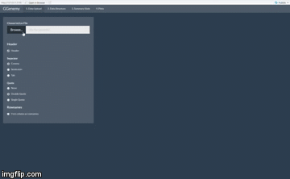

<!-- README.md is generated from README.Rmd. Please edit that file -->
GGenemy
=======

<!-- badges: start -->
[](https://travis-ci.org/tajohu/GGenemy) <!-- badges: end -->

`GGenemy` is a package that helps you in your analysis of multidimensional data by providing calculation and visualization tools for multiple conditioning. The user's workflow is mainly supported by an interactive Shiny app, but all of the package's main functions can be utilized in RStudio, too.

Installation
------------

`GGenemy` is available on GitHub. You can install the package and all its dependencies via the `install_github()` command from the `devtools` package.

``` r
# install.packages("devtools")
devtools::install_github("tajohu/GGenemy")
```

Workflow
--------

We will now walk you through the main working steps you will take when working with `GGenemy`. After loading and attaching the package, the shiny app is started by executing a function of the same name.

``` r
library(GGenemy)
GGenemy()
```

The command opens a tab in your browser that looks like this:

\[hier Foto ohne eingelesenen Datensatz einfügen\]

### Step 1: Data Upload

After successfully starting the app, you read in a .csv or .txt file that contains your data.



You get a first glimpse of what your dataset looks like and have several options to modify the way it is read.

### Step 2: Data Structure

The second step in your workflow will be getting a better feeling for the variables in your dataset. In the Data Structure Tab, you get to see a range of unconditional summary statistics for numerical and categorical variables, as well as the datasets general structure. Moreover, you have the chance to correct the class of any variables that might have been misclassified until now.

\[hier GIF von Data Structure einfügen, am besten mit Beispiel für Numeric -&gt; Factor\]

### Step 3: Summary Statistics

Step 3 introduces one of the two core functionalities of `GGenemy`: the calculation of conditional summary statistics. You are able to compute the conditional mean, variance, skewness and kurtosis for all your numeric variables, given another numeric variable. Further individual control of the process is given by a slider bar that determines the amount of quantiles you want to partition the given variable into.

The conditional summary statistics are displayed as values in a table and line plots for each variable.

\[hier GIF oder Foto von Summary Statistics einfügen, am besten mit Auswahl der Checkboxes und Berechnung der Werte\]

### Step 4: Plots

The heart of `GGenemy` lies in its fourth step, the visualization of conditional densities, boxplots and bar plots. You get to choose whether you want to condition on automatically set quantiles or ranges of values that you set yourself.

#### Automatic Quantiles

When choosing automatic quantiles, your data will be partitioned equally into the amount of quantiles you choose. When conditioning on a factor, the quantiles will be set to the variable's categories.

\[hier GIF/Foto von den normalen Plots einfügen\]

As a special feature, numeric variables can be plotted either as densities or as boxplots.

#### Chosen Quantiles

If you'd rather set the transition points between quantiles by yourself, `GGenemy` is giving you that option, too! Just head over to the correspondent tab and set the borders for up to three quantiles manually. If any other data points are left, they will be put into a fourth quantile with all remaining data.

\[Hier GIF/Foto einfügen\]

#### Save your results

For your convenience, `GGenemy` provides the possibility to download the plots you created in the Summary Statistics and Plots Tab, so that you can quickly retrace past results.
